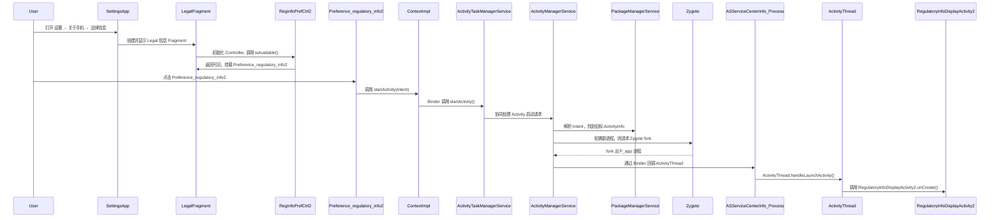
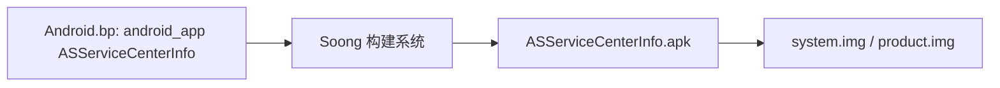
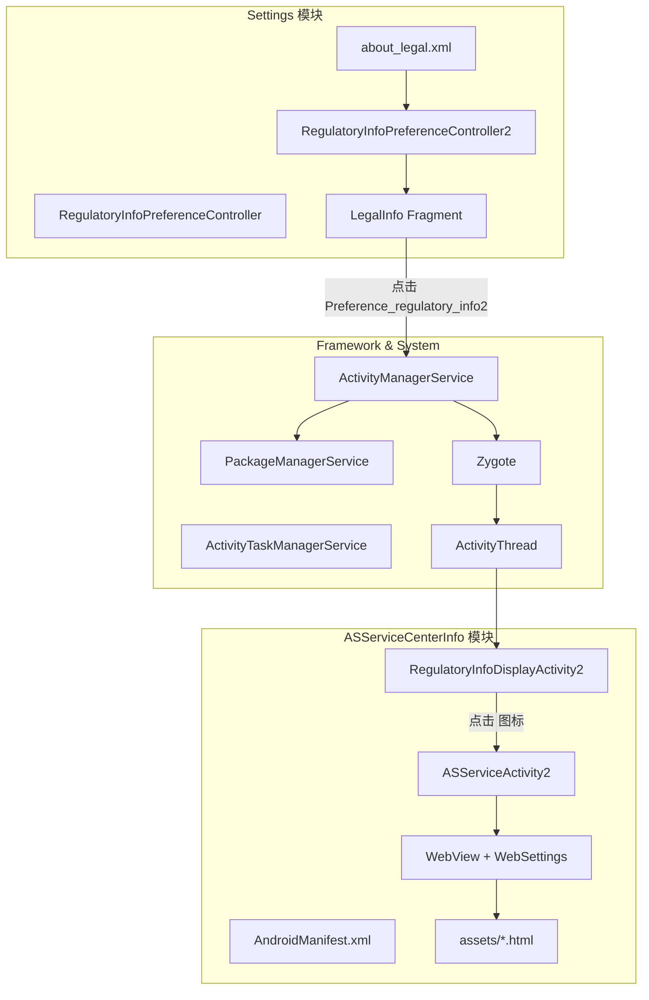

## 从 Settings 点击到内核调用的全栈剖析（Regulatory 自定义入口 Deep Dive）

本技术文档基于 `Regulatory labels` 自定义入口补丁，从 **程序调用链** 视角描述以下问题：  
在 `设置 → 关于手机 → 法律信息` 中点击 `Regulatory labels` 时，Android 系统在各层（Settings 应用、Framework、Zygote/进程创建、WebView/AssetManager、Soong 构建）执行的关键步骤与模块协作关系。

---

## 第一章：整体调用链鸟瞰（程序视角）

本章给出高层调用链与分层视角，为后续章节的细节分析提供整体参考。

### 1.1 高层时序图：从点击到 Activity 启动



图中体现的要点如下：

- Settings 作为一个普通系统应用，通过 `Context.startActivity` 提交启动请求。
- 进程调度与 Activity 启动由 Framework 中的 `ActivityTaskManagerService` / `ActivityManagerService` 与 Zygote 协同完成。
- `RegulatoryInfoDisplayActivity2` 实例最终由 App 进程中的 `ActivityThread` 在新进程或已有进程内创建。

### 1.2 分层视角：各层职责

调用链可抽象为四层结构：

- **App 层**：
  - `Settings`：`about_legal.xml` + `RegulatoryInfoPreferenceController2` + Fragment。
  - `ASServiceCenterInfo`：`RegulatoryInfoDisplayActivity2`、`ASServiceActivity2`、`WebView`。

- **Framework Java 层（system_server 进程）**：
  - `ActivityTaskManagerService` / `ActivityManagerService`：接收 `startActivity` 请求，决定启动哪个进程、哪个 Activity。
  - `PackageManagerService`：负责根据 Intent 找到对应的 `ActivityInfo`（看 Manifest）。

- **Native / 运行时层**：
  - `Zygote`：特殊的 Java 进程，负责 fork 出新的 App 进程。
  - `ActivityThread`：运行在 App 进程内的“主线程管理类”，负责分发生命周期回调（`onCreate` / `onResume` 等）。

- **内核层**：
  - `fork()` / `clone()`：真正创建进程的系统调用。
  - 调度 CPU 时间片，决定哪个线程什么时候运行。

后续章节围绕该分层结构展开具体调用路径分析。

---

## 第二章：Settings 侧架构与调用路径（从 XML 到点击事件）

本章描述 Settings 侧从 XML 配置到可点击 `Preference` 的生成过程，以及 Controller 在其中的角色。

### 2.1 从 `about_legal.xml` 到 Fragment

补丁在 `about_legal.xml` 中新增如下 `Preference`：

```xml
<!-- Custom Regulatory item inside Legal information (launches Revo ASServiceCenterInfo). -->
<Preference
    android:key="regulatory_info2"
    android:title="@string/regulatory_labels"
    settings:controller="com.android.settings.deviceinfo.RegulatoryInfoPreferenceController2">
    <intent
        android:action="android.intent.action.MAIN"
        android:targetPackage="com.revo.asservicecenterinfo"
        android:targetClass="com.revo.asservicecenterinfo.RegulatoryInfoDisplayActivity2" />
</Preference>
```

在 Settings 中，典型的配置页面通常由某个 `DashboardFragment` 子类实现，其执行流程包括：

1. 在 `onCreatePreferences` 或类似回调中加载对应的 XML（例如 `addPreferencesFromResource(R.xml.about_legal)`）。
2. `PreferenceManager` / `PreferenceScreen` 将 XML 解析为 Java 对象树（`Preference`、`PreferenceCategory` 等）。
3. Dashboard 框架根据 `settings:controller` 属性通过反射创建 Controller 实例，例如：

```java
// 伪代码，非真实源码
public void onAttach(Context context) {
    List<AbstractPreferenceController> controllers = new ArrayList<>();
    controllers.add(new RegulatoryInfoPreferenceController2(context));
    // ...
}
```

实际实现包含 `ControllerSupplier` / `DashboardFragment` 的注册与注入逻辑，但本质模式为：  
Fragment 负责加载 XML 并初始化 Controller，Controller 负责控制各个 `Preference` 的可用性与行为。

### 2.2 `RegulatoryInfoPreferenceController2` 的角色

新增的 Controller 定义如下：

```java
public class RegulatoryInfoPreferenceController2 extends AbstractPreferenceController
        implements PreferenceControllerMixin {

    private static final String KEY_REGULATORY_INFO = "regulatory_info2";

    public RegulatoryInfoPreferenceController2(Context context) {
        super(context);
    }

    @Override
    public boolean isAvailable() {
        return mContext.getResources().getBoolean(R.bool.config_show_regulatory_info2);
    }

    @Override
    public String getPreferenceKey() {
        return KEY_REGULATORY_INFO;
    }
}
```

要点如下：

- `getPreferenceKey()` 返回 `"regulatory_info2"`：  
  必须与 XML 中 `android:key="regulatory_info2"` 一致，以便 Fragment 将 Controller 绑定到对应的 `Preference`。

- `isAvailable()`：  
  Settings 在渲染界面时调用 Controller 的 `isAvailable()`，当返回 `false` 时，该 `Preference` 不被加入界面树。

通过该机制，可使用 `config_show_regulatory_info2` 控制该菜单项是否呈现。

### 2.3 旧 Controller 的改造与互斥关系

原有 `RegulatoryInfoPreferenceController` 的 `isAvailable()` 修改为：

```java
@Override
public boolean isAvailable() {
    final boolean customEnabled = mContext.getResources()
            .getBoolean(R.bool.config_show_regulatory_info2);
    if (customEnabled) {
        return false;
    } else {
        return !mContext.getPackageManager()
                .queryIntentActivities(INTENT_PROBE, 0).isEmpty();
    }
}
```

该修改实现以下互斥策略：

- 当 `config_show_regulatory_info2 == true` 时，新 Controller 控制 `regulatory_info2` 出现，旧 Controller 始终返回 `false`，原生入口隐藏。
- 当 `config_show_regulatory_info2 == false` 时，新入口不显示，旧入口按原有逻辑决定是否出现。

Settings 侧行为可总结为：

- XML 描述潜在菜单项集合及其 Intent、标题、key 等属性。
- Controller 根据设备配置和运行时条件决定每个菜单项是否参与渲染。

---

## 第三章：Intent 解析与 Activity 启动链路（Settings → ASServiceCenterInfo）

本章从 `Preference` 点击开始，跟踪到 AMS/PMS/Zygote 的调用路径。

### 3.1 Preference 点击后的应用侧流程

点击 `Preference` 后，Settings 侧典型伪代码如下：

```java
public class Preference {
    // 简化示例
    public void onClick() {
        if (mIntent != null) {
            Context context = getContext();
            context.startActivity(mIntent);
        }
    }
}
```

其中的 `mIntent` 对应 XML 中 `<intent>` 节点，包含：

- `action = android.intent.action.MAIN`
- `component = new ComponentName(\"com.revo.asservicecenterinfo\",
  \"com.revo.asservicecenterinfo.RegulatoryInfoDisplayActivity2\")`

因此，点击事件在应用层的本质为：在 Settings 进程内执行 `Context.startActivity(explicitIntent)`。

### 3.2 从 `Context.startActivity` 到 `ActivityTaskManagerService`

`ContextImpl.startActivity()` 的典型简化流程如下：

```java
public void startActivity(Intent intent) {
    intent.setFlags(Intent.FLAG_ACTIVITY_NEW_TASK);
    mMainThread.getInstrumentation().execStartActivity(
        this, mMainThread.getApplicationThread(), null, null, intent, -1, null);
}
```

`Instrumentation.execStartActivity()` 内部通过 AIDL 接口调用 `ActivityTaskManagerService`（或旧版本中的 `ActivityManagerService`）：

```java
int result = ActivityTaskManager.getService().startActivity(
    appThread, mBasePackageName, intent, intentType, token, ...);
```

此调用为典型的 **Binder 跨进程调用**：

- 客户端：Settings 进程中的 `ContextImpl` / `Instrumentation`。
- 服务端：`system_server` 进程中的 `ActivityTaskManagerService` / `ActivityManagerService`。

### 3.3 AMS 内部：解析 Intent、选择 Activity、决定进程

在 `ActivityTaskManagerService` / `ActivityManagerService` 中，启动请求大致经历以下步骤：

1. **Intent 解析**：
   - 调用 `PackageManagerService` 的接口，根据组件名（component）直接拿到 `ActivityInfo`：  
     - 包括 `processName`、`launchMode`、exported、权限要求等。

2. **任务栈/栈顶 Activity 处理**：
   - 根据当前任务栈情况，决定是新建 task 还是复用已有 task（`FLAG_ACTIVITY_NEW_TASK` 等）。

3. **进程管理**：

   - 查询是否存在 `com.revo.asservicecenterinfo` 对应的运行中进程：
     - 已存在时，在该进程中调度新的 Activity 启动。
     - 不存在时，进入“新建进程”路径，通过 Zygote fork 新进程。

AMS 的核心职责可概括为：

- 调度 Activity：控制前台 Activity 与任务栈管理。
- 管理进程：决定进程创建与回收时机。

### 3.4 启动新进程：Zygote 与内核 fork

当 AMS 决定需要创建新进程时，调用链（概念级）类似如下：

```java
Process.start(...);
// 内部通过 ZygoteProcess 与 Zygote 守护进程通信：
zygoteProcess.start(...);  // 通过 socket 向 Zygote 发送“fork”请求
```

Zygote 进程收到请求后：

1. 调用 native 层的 `fork()` / `clone()` 系统调用（此处真正进入 Linux 内核创建新进程）。
2. 在子进程中执行 Java 入口 `ActivityThread.main()`。

`ActivityThread.main()` 的关键逻辑如下：

```java
public static void main(String[] args) {
    Looper.prepareMainLooper();
    ActivityThread thread = new ActivityThread();
    thread.attach(false);
    Looper.loop(); // 进入消息循环
}
```

`attach()` 通过 Binder 再次回连 `ActivityManagerService`，标识当前进程已经就绪，可在该进程中创建 Activity。

随后 AMS 向该进程内的 `ActivityThread` 发送 `LAUNCH_ACTIVITY` 消息，执行：

```java
ActivityThread.handleLaunchActivity(ActivityClientRecord r, ...) {
    Activity activity = performLaunchActivity(r, ...); // 这里 new 你的 Activity
    // 再调用 activity.onCreate() / onStart() / onResume()
}
```

至此，`RegulatoryInfoDisplayActivity2.onCreate()` 在目标进程中开始执行。

---

## 第四章：ASServiceCenterInfo 内部调用栈与 WebView 相关库

本章聚焦 `ASServiceCenterInfo` APK 内部两个 Activity 之间的调用关系，以及 WebView/AssetManager 所涉及的主要类和层次。

### 4.1 第一个 Activity：`RegulatoryInfoDisplayActivity2`

核心代码（简化）如下：

```java
public class RegulatoryInfoDisplayActivity2 extends Activity {

    @Override
    protected void onCreate(Bundle savedInstanceState) {
        super.onCreate(savedInstanceState);
        setContentView(R.layout.regulatory_layout1);

        ImageView imageView = findViewById(R.id.regulatoryIcon_3);
        imageView.setOnClickListener(new View.OnClickListener() {
            @Override
            public void onClick(View v) {
                Intent intent = new Intent(RegulatoryInfoDisplayActivity2.this,
                        ASServiceActivity2.class);
                startActivity(intent);
            }
        });
    }
}
```

该 Activity 的调用顺序如下：

1. `ActivityThread.handleLaunchActivity()` 触发 `RegulatoryInfoDisplayActivity2.onCreate()`。
2. `setContentView(regulatory_layout1)`：
   - 通过 `LayoutInflater` 解析 XML，构建视图树。
3. `findViewById(R.id.regulatoryIcon_3)`：
   - 在视图树中查找对应 `ImageView`。
4. `setOnClickListener(...)`：
   - 注册点击监听器，用户点击图标时回调 `onClick`。
5. 点击事件中再次调用 `startActivity(new Intent(..., ASServiceActivity2.class))`：
   - 通常无需重新 fork 进程（同一应用进程内 Activity 切换），AMS 仅负责调整 Activity 栈。

### 4.2 第二个 Activity：`ASServiceActivity2` 与 WebView

核心代码（简化）如下：

```java
public class ASServiceActivity2 extends Activity {

    private WebView webView;
    private String showHtml = "";

    @Override
    protected void onCreate(Bundle savedInstanceState) {
        super.onCreate(savedInstanceState);
        requestWindowFeature(Window.FEATURE_NO_TITLE);
        setContentView(R.layout.activity_main2);

        showHtml = getString(R.string.showHtmlString);
        webView = findViewById(R.id.webview);

        WebSettings webSettings = webView.getSettings();
        webSettings.setJavaScriptEnabled(true);
        webSettings.setUseWideViewPort(true);
        webSettings.setLoadWithOverviewMode(true);
        webSettings.setBuiltInZoomControls(true);
        webSettings.setDisplayZoomControls(false);
        webSettings.setSupportZoom(true);

        webView.loadUrl(showHtml);
    }
}
```

涉及的主要类与库包括：

- `android.webkit.WebView`：
  - Java 层控件，背后对接系统内嵌浏览器引擎（WebKit/Chromium）。
  - 内部启动一个或多个 Web 引擎线程处理网络请求、HTML 解析与渲染。

- `android.webkit.WebSettings`：
  - 用于配置 WebView 行为，例如：
    - `setJavaScriptEnabled(true)` 最终调用 native/Chromium 接口开启 JavaScript 引擎。
    - `setUseWideViewPort` / `setLoadWithOverviewMode` 影响布局视口参数。

### 4.3 `loadUrl("file:///android_asset/...")` 的资源访问路径

执行如下调用：

```java
webView.loadUrl("file:///android_asset/CITYLIGHT_SERVICE_CENTER.html");
```

大致执行路径如下：

1. WebView 内部识别 `file://` 协议，且路径以 `/android_asset/` 开头。
2. 对此类 URL，WebView 不访问真实文件系统，而是通过 `AssetManager` 读取 APK 中的 `assets/` 目录：

   - App 进程内存在 `AssetManager` 实例，负责从 APK Zip 包中按路径读取资源。
   - 请求 `CITYLIGHT_SERVICE_CENTER.html` 时，在 APK 内 `assets/` 目录查找对应条目。

3. 读取到 HTML 后交由 Web 引擎解析：
   - 解析 HTML、构建 DOM 树、执行布局与绘制，并通过 `SurfaceView` / `TextureView` 等方式输出到屏幕。

上述链路可抽象为如下分层图：

```mermaid
flowchart TD
    subgraph appCode[App Java 代码]
        A[ASServiceActivity2] --> B[WebView.loadUrl()]
    end

    subgraph framework[Framework Java 实现]
        B --> C[WebViewCore/ChromiumBridge]
        C --> D[AssetManager.openNonAsset]
    end

    subgraph native[Native/Chromium]
        D --> E[读取 APK Zip 中的 assets 文件]
        E --> F[HTML Parser & Layout & Paint]
    end

    subgraph kernel[内核]
        F --> G[与 GPU/显示驱动协同绘制]
    end
```

---

## 第五章：Soong 构建链路与系统集成

本章描述 `ASServiceCenterInfo` 从 `Android.bp` 配置到系统镜像中系统应用的构建与集成过程。

### 5.1 Soong 中的 `android_app` 模块

`Android.bp` 中的定义如下：

```python
android_app {
    name: "ASServiceCenterInfo",
    platform_apis: true,
    certificate: "platform",
    srcs: ["src/**/*.java"],
    resource_dirs: ["res"],
    asset_dirs: ["assets"],
    // ...
}
```

在 Soong 中：

- 每个 `android_app` 模块编译为一个 APK，产物通常位于：
  - `out/target/product/<device>/system/priv-app/ASServiceCenterInfo/ASServiceCenterInfo.apk`
  - 或按产品配置位于 `system/app`、`product/app` 等目录。
  
- `platform_apis: true` 与 `certificate: "platform"` 组合：
  - 表示该 APK 链接平台内部 API，并使用 platform key 签名。
  - 由此可访问部分仅系统/priv-app 可用的接口（具体取决于权限声明与策略）。

### 5.2 从 bp 到镜像的大致路径

整体构建路径可概括为：



更细化的步骤包括：

1. `soong_ui.bash` 解析所有 `Android.bp`，构建模块图（module graph）。
2. 对于 `ASServiceCenterInfo` 模块：
   - 编译 Java 源码生成 classes。
   - 使用 aapt2 处理资源，生成 `R.java` 与 `resources.arsc`。
   - 打包生成 APK 并进行签名。
3. 按产品 makefile / product configuration 配置：
   - 将 `ASServiceCenterInfo` 放入对应分区路径（例如 `/system/priv-app`）。
4. 生成系统镜像（例如 `system.img`）。

系统启动后：

- `PackageManagerService` 扫描 `/system/priv-app`、`/system/app` 等目录，将 APK 注册为可用 Package。
- 当 Settings 发送 Intent 请求时，PMS 已能够解析 `com.revo.asservicecenterinfo` 及其内的 Activity 信息。

---

## 第六章：联动关系总览与调试建议

### 6.1 模块/层级联动关系图



该图从模块维度展示补丁中各关键部件之间的关联关系：

- Settings 侧的 XML、Controller 与 Fragment。
- `ASServiceCenterInfo` APK 内的 Manifest、Activity、WebView 及 HTML 资源。
- Framework 层的 AMS/PMS/Zygote/ActivityThread。

### 6.2 调试思路与常见问题（Checklist）

**1）Preference 点击无响应**

- 检查 `RegulatoryInfoPreferenceController2.isAvailable()`：
  - 使用 `adb shell dumpsys activity top` 或在代码中临时添加日志，确认 `config_show_regulatory_info2` 是否为 `true`。
- 检查 `about_legal.xml` 中的 `<intent>`：
  - 核对 `targetPackage` 和 `targetClass` 是否与 Manifest 中完全一致。

**2）点击后进程崩溃**

- 通过 `adb logcat` 查看 `AndroidRuntime` / `ActivityManager` 日志：
  - 是否为 `ClassNotFoundException`（类名错误或未编入 APK）。
  - 是否为 `ActivityNotFoundException`（Manifest 未注册或 `exported=false`）。
  - 是否为 `NullPointerException` 出现在 `onCreate()`（例如 `findViewById` 返回 null）。

**3）WebView 无法正常显示 HTML**

- 检查 `strings.xml` 中的 `showHtmlString`：

```xml
<string name="showHtmlString">file:///android_asset/CITYLIGHT_SERVICE_CENTER.html</string>
```

  - 校验文件名是否与 `assets` 中 HTML 文件完全一致（包含大小写）。
  - 使用 `unzip -l ASServiceCenterInfo.apk` 检查 `assets` 中是否包含目标 HTML。

- 检查 WebView 设置：
  - 确认未误禁用 JavaScript（在 HTML 依赖 JS 场景下）。

**4）需要观察 AMS / Activity 启动细节**

- 可使用以下命令增强日志：
  - `adb shell setprop log.tag.ActivityManager DEBUG`
  - 或按 ROM 支持情况开启 AMS 调试日志。
- 然后通过 `adb logcat | grep ActivityManager` 观察：
  - 如 `START u0 {cmp=com.revo.asservicecenterinfo/.RegulatoryInfoDisplayActivity2}` 等启动日志。

---

## 总结

本文从 Settings 应用、Android Framework、Zygote/进程创建、应用内部 Activity 调度、WebView 资源访问以及 Soong 构建与镜像集成等多个层面，对 `Regulatory labels` 自定义入口进行了全栈分析。  
调用链主线可概括为：Settings 中的 `about_legal.xml` 与 `RegulatoryInfoPreferenceController2` 控制入口可见性，通过显式 Intent 触发 AMS/ATM，借助 PMS 与 Zygote 完成进程与 Activity 启动，最终在 `ASServiceCenterInfo` 内部通过 WebView 与 AssetManager 渲染 `assets` 中的 HTML 内容。  
相关配置与实现模式具有较强的可复用性，可作为在 AOSP Settings 中集成自定义系统应用入口的参考范式。

